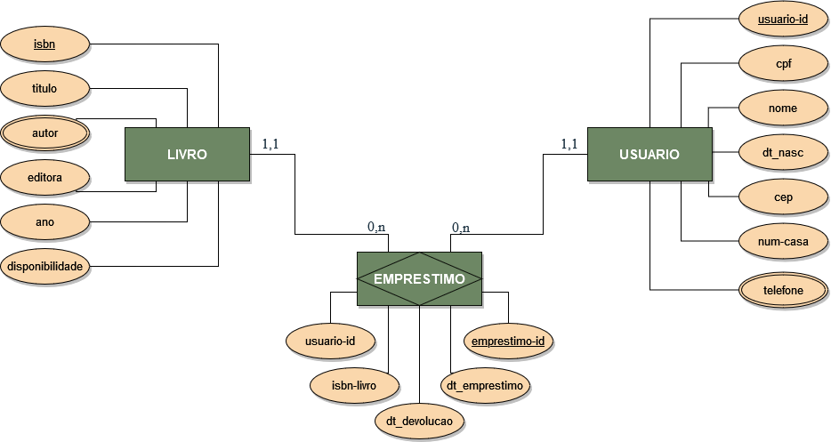

# Código do Projeto

As classes no arquivo `Classes.sybox` devem ser importadas na plataforma Sydle One para que possam ser utilizadas, nelas está presente 3 classes: `Empréstimo`, `Livros` e `Usuários`, os quais foram modelados a partir do Diagrama de Entidade e Relacionamento abaixo.

